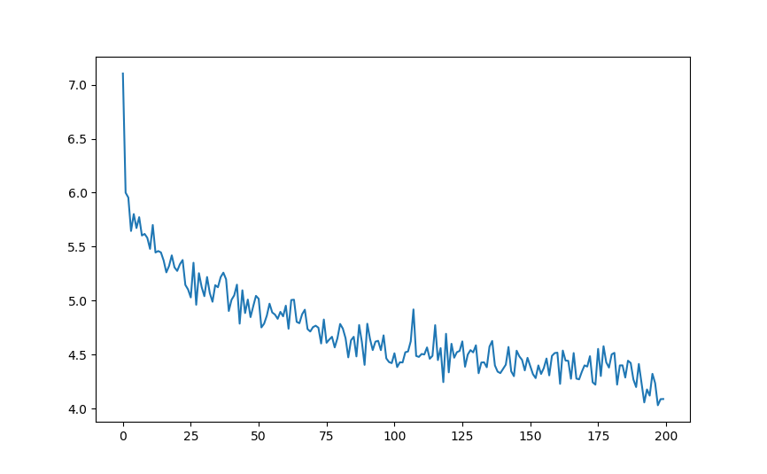

# vanilla_rnn_text_generator
Having fun with generation of simple sentences with vanilla RNN trained on J. D. Salinger's pieces

7k sentences data, 10k training examples (better loop more over the dataset) 

**Training:**

* 0m 45s (500 5%) 6.7136216164
* 1m 30s (1000 10%) 4.6620235443
* 2m 25s (1500 15%) 6.5757226562
* 3m 22s (2000 20%) 4.0616414206
* 4m 11s (2500 25%) 6.1401309967
* 5m 6s (3000 30%) 4.7101268768
* 6m 6s (3500 35%) 5.4845242500
* 6m 56s (4000 40%) 5.8788118362
* 7m 50s (4500 45%) 5.5062906602
* 8m 44s (5000 50%) 4.3924589891
* 9m 44s (5500 55%) 4.1405781337
* 10m 41s (6000 60%) 5.1260630290
* 11m 37s (6500 65%) 4.6683835630
* 12m 29s (7000 70%) 5.3833421980
* 13m 24s (7500 75%) 5.5978495280
* 14m 14s (8000 80%) 3.4084121704
* 15m 7s (8500 85%) 4.7572093964
* 15m 52s (9000 90%) 4.9067153931
* 16m 36s (9500 95%) 3.6275477939
* 17m 24s (10000 100%) 4.0689102809

**Loss:**

**Examples:**
* i do n't know if you want it to say
* they ca n't even reading it
* i knew i had near that she said c'mon
* the band had a crazy story up i was n't even irritated to get anything in her fifteen
* i did n't even have to get the war or something
* they looked in the park side i did even have to go around and all
* then i sat down in the chair she said and you 're all over her
* i told her i had being a doctor
* got please when you always phony a one
* i mean in the little time to a child at a doctor
* then she said '' he was lucky though when i was different
* i put her player goddam arm the shut
* that 's it that i said
* i do n't have her and do n't know i said
* i told leave a chair and boxes you get them to go
* my face was down a little bit but you have to terrific it
* i mean they thought i ca n't look that that we i started to be what me ? i said
* i was n't like to see that 's i told her and i say it to have about this bastard
* i just got to go in the room started to stop the damn forward in the way
* what i probably knew they have down to and school
* i sort of see around he said

**Readings:**
* http://karpathy.github.io/2015/05/21/rnn-effectiveness/
* https://pytorch.org/tutorials/intermediate/char_rnn_classification_tutorial.html
* http://www.wildml.com/2015/09/recurrent-neural-networks-tutorial-part-2-implementing-a-language-model-rnn-with-python-numpy-and-theano/

